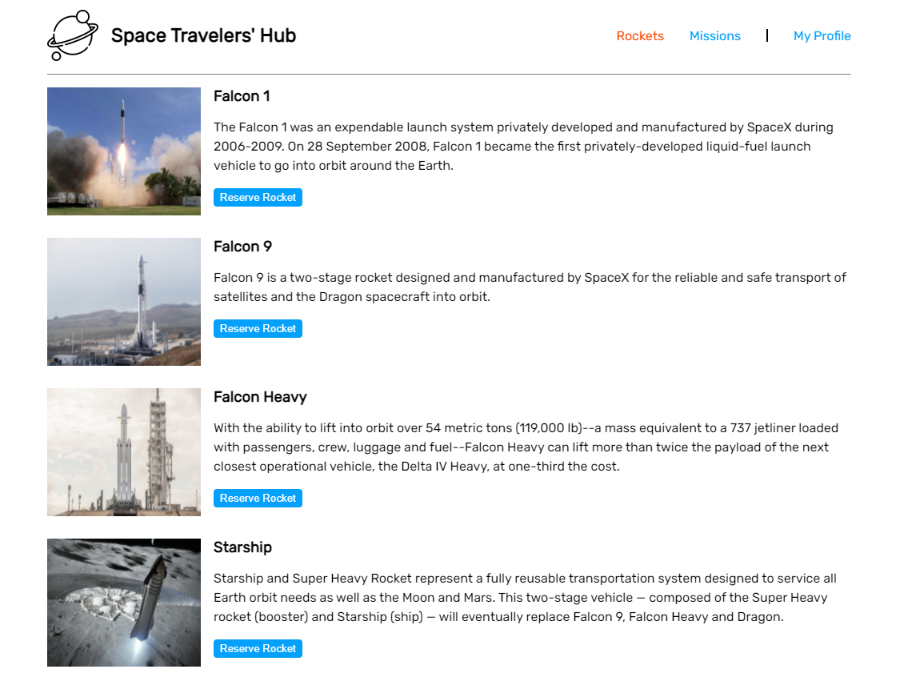

# Space Travelers' Hub

This web helps you reserved SpaceX rockets and missions of your liking. You can join a mission or leave it if you don't like it any more. ALl the reserved rockets and joined missions can be accessed from My Profile section.
### Live link
- [link](spacextravelershub.netlify.app)

Additional description about the project and its features.

## Tools used

- React.js
- Css Modules
- npm

## Api used

- https://api.spacexdata.com/v3

## Prerequisites

The basic requirements for building the executable are:

- A working browser application (Google chrome, Mozilla Fire fox, Microsoft edge ...)
- VSCode or any other equivalent code editor
- Node Package Manager (For running, debuging, or installing dependancies to be used)

## Available scripts

### `npm install`

To install all the dependencies to run and debug the application in local environment.

### `npm start`

Runs the app in the development mode.
Open [http://localhost:8080](http://localhost:8080) to view it in the browser.

### `npm run build`

Builds the app for production to the `build` folder.
It correctly bundles the app in production mode and optimizes the build for the best performance.

#### Cloning the project

git clone https://github.com/muneebulrehman/Space-travellers-hub.git

## Authors

👤 **Muneeb Ul Rehman**

- GitHub: [@Muneeb](https://github.com/muneebulrehman)
- Twitter: [@NeatCoder\_](https://twitter.com/NeatCoder_)
- LinkedIn: [Muneeb](https://www.linkedin.com/in/muneeb-ul-rehman-33903b159/)

👤 **Souad El Mansouri**

- GitHub: [@Souad](https://github.com/souad988)
- Twitter: [@twitter](https://twitter.com)
- LinkedIn: [LinkedIn](https://www.linkedin.com/)

Contributions, issues, and feature requests are welcome!

Feel free to check the [issues page](https://github.com/muneebulrehman/Space-travellers-hub/issues).

## Show your support

Give a ⭐️ if you like this project!
